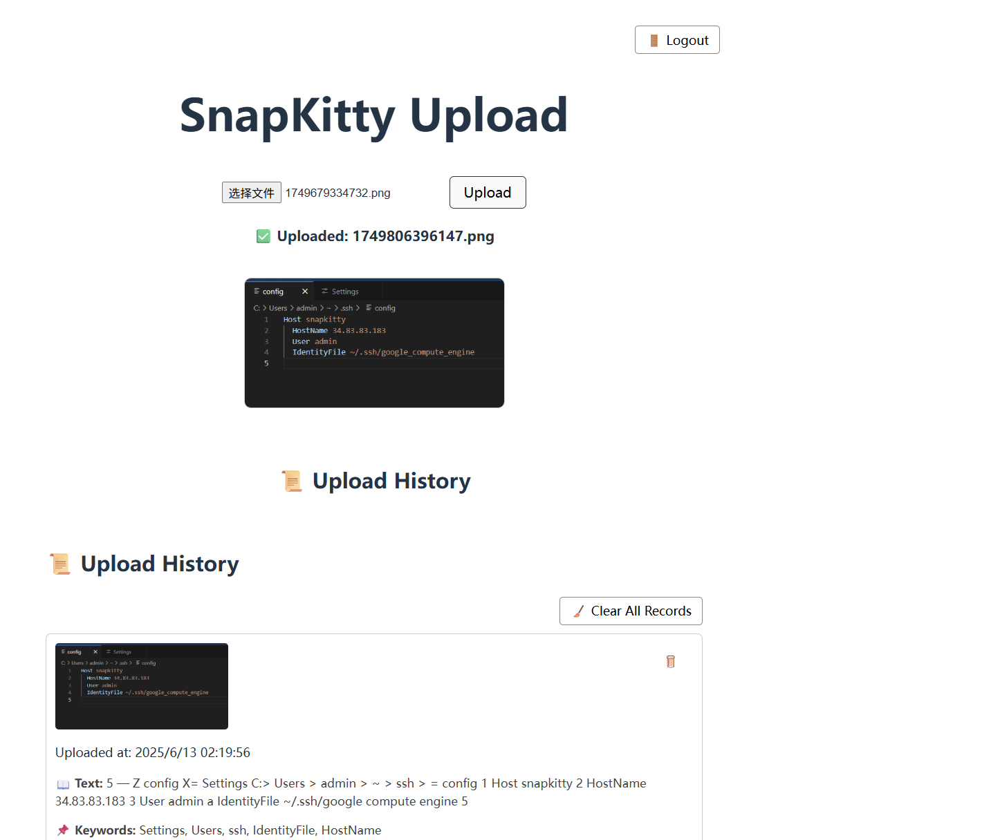

# 📸 SnapKitty

**SnapKitty** is a full-stack web application for uploading, analyzing, and solving image-based questions. Built with **Node.js**, **React**, and **MongoDB**, it integrates **OCR (Tesseract.js)** and **OpenAI GPT** to extract and solve textual problems from uploaded images.

---

## ✨ Features

* 📄 Upload image-based questions
* 🔍 OCR-based text extraction (Tesseract.js)
* 🧠 GPT-powered keyword extraction and problem solving
* 📚 History view with per-user upload records
* 🧹 Delete individual or all records
* ✅ User registration & login (JWT authentication)
* 🔐 Data isolation per user
* 🚪 Logout support
* ☁️ Google App Engine compatible

---

## 🧱 Tech Stack

| Layer     | Technology               |
| --------- | ------------------------ |
| Frontend  | React + Vite             |
| Backend   | Node.js + Express        |
| Database  | MongoDB Atlas            |
| Auth      | JWT (JSON Web Tokens)    |
| OCR       | Tesseract.js             |
| AI Solver | OpenAI GPT-3.5 Turbo API |
| Hosting   | Google App Engine (GAE)  |

---

## 🧪 Local Development

### 1. Clone the repo

```bash
git clone https://github.com/YOUR_USERNAME/snapkitty.git
cd snapkitty
```

### 2. Install dependencies

#### Backend:

```bash
npm install
```

#### Frontend:

```bash
cd client
npm install
```

### 3. Environment variables

Create a `.env` file in the root directory:

```env
MONGODB_URI=your_mongodb_connection_string
OPENAI_API_KEY=your_openai_key
JWT_SECRET=your_custom_secret
PORT=3001
```

> ✅ Do **not** commit `.env` or `app.yaml`. These files are git-ignored.

### 4. Run locally

```bash
# In one terminal
npm run dev     # Start frontend (Vite)

# In another terminal
npm start       # Start backend (Express on port 3001)
```

Then go to `http://localhost:5173`.

---

## 🚀 Deployment (GAE-ready)

* Includes a valid `app.yaml` (ignored from git)
* Static build works with `public/` folder
* Uses `/tmp` for image storage on GAE

---

## 📌 API Endpoints

| Method | Route                | Description                       |
| ------ | -------------------- | --------------------------------- |
| POST   | `/api/register`      | Register new user                 |
| POST   | `/api/login`         | Login and receive JWT token       |
| GET    | `/api/me`            | Verify token and fetch user info  |
| POST   | `/api/upload`        | Upload image + OCR + GPT keywords |
| POST   | `/api/solve/:id`     | Solve extracted text via GPT      |
| GET    | `/api/records`       | Fetch current user’s records      |
| DELETE | `/api/records/:id`   | Delete a single record            |
| GET    | `/api/clear-records` | Delete all records (for dev)      |

---

## 🛡️ Security

* All endpoints require valid JWT
* Uploaded records are isolated per user
* `.env` and `app.yaml` are git-ignored by default

---

## 📷 Screenshots



---

## 🛎️ Credits

Built with ❤️ for the CS144 Final Project @ UCLA
By: \[Jingyu Liu/ 43]
Advisor: Prof. Rosario

---

## 📓 License

MIT License
